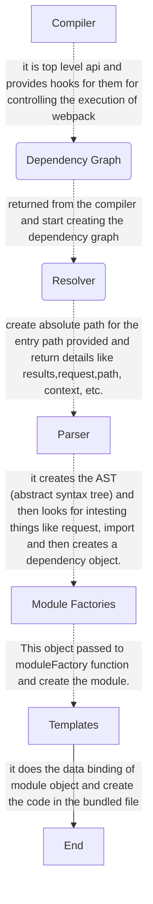

## Create Your Own Custom Webpack

I am following this article for making my first custom webpack loader [(link)](https://kettanaito.com/blog/writing-custom-webpack-loader)

Loader: Loader in webpack is function hat transform source code imported module
Think like - css-loader, babel-loader

Convert the ts to js code, scss to css and jsx element to React.createElement this all magic happens with the loaders

Webpack is responsible for establishing a transformation chain for your source code and making sure that the loaders are executed at the right stage of the build process.

- Limitation
  Loaders are designed to transform code. Unlike plugins, loaders cannot affect the build process, but rather transform individual imported modules during the build.Keep in mind, plugins does not tansform code.

- Role of Module Bundler
  The goal of basic module bundler is to read the source code, find the dependencies - this is called dependency resolution.
  During the dependency resolution, bundler does the module mapping (module map) bundling them into one file, packaging it into one module. So webpack just do this all things in advanced way and add some other method to make it more efficient.

- Breakdown of Webpack Architecture

* Compiler - it is top level api and provides hooks for them for controlling the execution of webpack
* Compilation or dependency graph - returned from the compiler and start creating the dependency graph
* Resolver - create absolute path for the entry path provided and return details like results,request,path, context, etc.
* Parser - it creates the AST (abstract syntax tree) and then looks for intesting things like request, import and then creates a dependency object.
* Module Factories - This object passed to moduleFactory function and create the module.
* Templates - it does the data binding of module object and create the code in the bundled file

> webpack provides hooks for the compiler, parser, and compilations. It uses a library called `tapable`, which is maintained by the webpack team and helps in creating strong and powerful hooks where we can tap into methods.

- Hooks and Tapping in methods are like event listener
- How webpack Uses tapable & How Plugins Coming Into the Picture?
  Webpack creates hook for compiler, compilation/dependency graph and parser stages using tapable and the plugins taps into them and acts accordingly.
